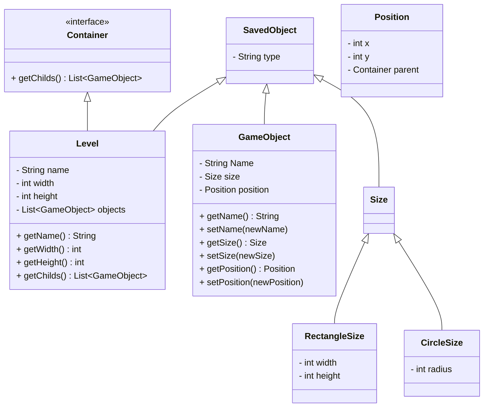



# Die Klassen

## SavedObject
```Java
package org.jadv.model;

import com.google.gson.annotations.JsonAdapter;
import lombok.EqualsAndHashCode;
import lombok.Getter;
import org.jadv.serialization.SavedObjectAdapter;

/**
 * An instance that can be saved through an Adapter and contains the name of the class as field.
 */
@EqualsAndHashCode
@JsonAdapter(SavedObjectAdapter.class)
public abstract class SavedObject {
    /**
     * Class name of the instance.
     */
    @Getter
    private final String type = getClass().getName();
}
```
## Container
```Java
package org.jadv.model;

import org.jadv.model.objects.GameObject;

import java.util.List;

/**
 * A Container has a list of GameObject as children.
 */
public interface Container {
    /**
     * Gets the List of GameObject children.
     * @return List of GameObjects.
     */
    List<GameObject> getChildren();
}
```
## Level
```Java
package org.jadv.model.level;

import com.google.gson.annotations.JsonAdapter;
import lombok.*;
import org.jadv.model.Container;
import org.jadv.model.Position;
import org.jadv.model.SavedObject;
import org.jadv.model.objects.GameObject;
import org.jadv.serialization.ListOfSavedObjectAdapter;

import java.util.ArrayList;
import java.util.List;

/**
 * JAdventure Level
 */
@Getter
@NoArgsConstructor
@AllArgsConstructor
@ToString
@EqualsAndHashCode(callSuper=true)
public class Level extends SavedObject implements Container {

    /**
     * Name of the Level.
     */
    private String name;

    /**
     * Width of the level.
     */
    private int width;

    /**
     * Height of the level.
     */
    private int height;

    /**
     * Game objects inside the level.
     */
    @JsonAdapter(ListOfSavedObjectAdapter.class)
    private final List<GameObject> objects = new ArrayList<>();

    public void removeObject(@NonNull GameObject obj) {
        objects.remove(obj);
    }

    public void addObject(@NonNull GameObject obj, int x, int y) {
        objects.add(obj);
        obj.setPosition(new Position(x, y, this));
    }

    @Override
    public List<GameObject> getChildren() {
        return objects;
    }
}
```
## GameObject
```Java
package org.jadv.model.objects;

import com.google.gson.annotations.JsonAdapter;
import lombok.*;
import org.jadv.model.Position;
import org.jadv.model.SavedObject;
import org.jadv.model.size.Size;
import org.jadv.serialization.SavedObjectAdapter;

/**
 * An Object inside the JAdventure game.
 */
@Getter
@Setter
@ToString
@NoArgsConstructor
@AllArgsConstructor
@Builder
@EqualsAndHashCode(callSuper=true)
public class GameObject extends SavedObject {

    /**
     * Name of the Object.
     */
    private String name;

    /**
     * Size of the Object.
     */
    @JsonAdapter(SavedObjectAdapter.class)
    private Size size;

    /**
     * Position of the Object.
     */
    private Position position;
}
```
## Size
```Java
package org.jadv.model.size;

import com.google.gson.annotations.JsonAdapter;
import org.jadv.model.SavedObject;
import org.jadv.serialization.SavedObjectAdapter;

/**
 * Size of an GameObject
 */
@JsonAdapter(SavedObjectAdapter.class)
public abstract class Size extends SavedObject { }
```
## CircleSize
```Java
package org.jadv.model.size;

import lombok.*;

/**
 * Size of a circular object.
 */
@Getter
@AllArgsConstructor
@NoArgsConstructor
@ToString
@EqualsAndHashCode(callSuper=true)
public class CircleSize extends Size {
    /**
     * Radius of the circle around the object location.
     */
    private int radius;
}
```
## RectangleSize
```Java
package org.jadv.model.size;

import lombok.*;

/**
 * Rectangle Size
 */
@Getter
@AllArgsConstructor
@NoArgsConstructor
@ToString
@EqualsAndHashCode(callSuper=true)
public class RectangleSize extends Size {

    /**
     * Width of the object.
     */
    int width;

    /**
     * Height of the object.
     */
    int height;
}
```
## Position
```Java
package org.jadv.model;

import lombok.AllArgsConstructor;
import lombok.Getter;

/**
 * Position stores the position of an GameObject inside the game.
 */
@Getter
@AllArgsConstructor
public class Position {
    /**
     * X Coordiante.
     */
    private int x;

    /**
     * Y Coordinate
     */
    private int y;

    /**
     * Parent of this Object.
     */
    private transient Container parent;

    public void setParent(final Container parent) {
        if (this.parent != null) throw new IllegalStateException("Parent already set!");

        this.parent = parent;
    }
}
```
## SavedObjectAdapter
```Java
package org.jadv.serialization;

import com.google.gson.*;
import org.jadv.model.Container;
import org.jadv.model.SavedObject;
import org.jadv.model.objects.GameObject;

import java.lang.reflect.Type;
import java.util.Objects;

/**
 * Gson Adapter to (de-)serialize derived types.
 * Just serialize / deserialize with type SavedObject to use this adapter.
 */
final public class SavedObjectAdapter implements JsonSerializer<SavedObject>, JsonDeserializer<SavedObject> {

    /**
     * Name of the element that describes the type.
     */
    public static final String TYPE_ELEMENT_NAME = "type";

    /**
     * Serializes an SavedObject to JSON. Makes sure that the serialization is using the correct class.
     * @param object Object to serialize.
     * @param interfaceType Not used.
     * @param context Serialization context.
     * @return The JsonElement that holds the serialized object.
     */
    @Override
    public JsonElement serialize(final SavedObject object, final Type interfaceType,
                                 final JsonSerializationContext context) {
        if (object == null) return null;
        return context.serialize(object, object.getClass());
    }

    /**
     * Deserializes the SavedInstance from a json.
     * @param elem Json element to deserialize
     * @param interfaceType not used.
     * @param context Deserialization context.
     * @return The restored instance with correct class.
     * @throws JsonParseException Throws an JsonParseException if deserialization is not possible.
     */
    @Override
    public SavedObject deserialize(final JsonElement elem, final Type interfaceType,
                                   final JsonDeserializationContext context) throws JsonParseException {
        final JsonObject wrapper = (JsonObject) elem;
        final JsonElement typeName = getType(wrapper);
        final Type actualType = typeForName(typeName);
        SavedObject result =  context.deserialize(elem, actualType);
        setParentReferencesIfRequired(result);
        return result;
    }

    /**
     * The parent reference inside the Position of a GameObject is transient and is not saved.
     * So when deserializing a container, we have to set the parent again.
     * @param object SavedObject to check and set Parent if required.
     */
    private void setParentReferencesIfRequired(final SavedObject object) {
        if (object instanceof Container container) {
            container.getChildren().stream()
                    .map(GameObject::getPosition)
                    .filter(Objects::nonNull)
                    .forEach(p -> p.setParent(container));
        }
    }

    /**
     * Gets the type for a given name.
     * @param typeElem JsonElement with classname inside.
     * @return The requested class.
     * @throws JsonParseException Thrown if the class is not available / known.
     */
    private Type typeForName(final JsonElement typeElem) throws JsonParseException {
        try {
            return Class.forName(typeElem.getAsString());
        } catch (ClassNotFoundException e) {
            throw new JsonParseException(e);
        }
    }

    /**
     * Gets a child element of an JsonObject,
     * @param wrapper Wrapper JsonObject to get the element from.
     * @return The requested JsonElement.
     * @throws JsonParseException Thrown if the requested element is not available.
     */
    private JsonElement getType(final JsonObject wrapper) throws JsonParseException {
        final JsonElement elem = wrapper.get(TYPE_ELEMENT_NAME);
        if (elem == null) throw new JsonParseException("no '" + TYPE_ELEMENT_NAME + "' member found in what was expected to be an interface wrapper");
        return elem;
    }
}
```
## ListOfSavedObjectAdapter
```Java
package org.jadv.serialization;

import com.google.gson.*;
import org.jadv.model.SavedObject;

import java.lang.reflect.Type;
import java.util.ArrayList;
import java.util.List;

/**
 * Gson Adapter to (de-)serialize a List of SavedObjects
 * Prefix the List with @JsonAdapter(ListOfSavedObjectAdapter.class) to use this Adapter
 */
final public class ListOfSavedObjectAdapter implements JsonSerializer<List<? extends SavedObject>>, JsonDeserializer<List<? extends SavedObject>> {
    /**
     * Serializes a list of SavedInstance to JSON.
     * @param list Object to serialize.
     * @param interfaceType Not used.
     * @param context Serialization context.
     * @return The JsonElement that holds the serialized list.
     */
    public JsonElement serialize(final List<? extends SavedObject> list, final Type interfaceType,
                                 final JsonSerializationContext context) {
        if (list == null) return null;
        final JsonArray array = new JsonArray();
        for (SavedObject obj : list) {
            array.add(context.serialize(obj, SavedObject.class));
        }
        return array;
    }

    /**
     * Deserializes the list of SavedInstance from a json.
     * @param elem Json element to deserialize
     * @param interfaceType not used.
     * @param context Deserialization context.
     * @return The restored list with elements with correct class.
     * @throws JsonParseException Throws an JsonParseException if deserialization is not possible.
     */
    public List<? extends SavedObject> deserialize(final JsonElement elem, final Type interfaceType,
                                         final JsonDeserializationContext context) throws JsonParseException {
        List<SavedObject> result = new ArrayList<>();
        final JsonArray array = (JsonArray) elem;
        for (JsonElement element : array.asList()) {
            result.add(context.deserialize(element, SavedObject.class));
        }
        return result;
    }
}
```

# Klassendiagramm

Das folgende Klassendiagram zeigt in erster Linie die Vererbung. Assoziationen / Kompositionen und Aggregationen sind nicht eingezeichnet um das Diagramm einfach zu halten.



