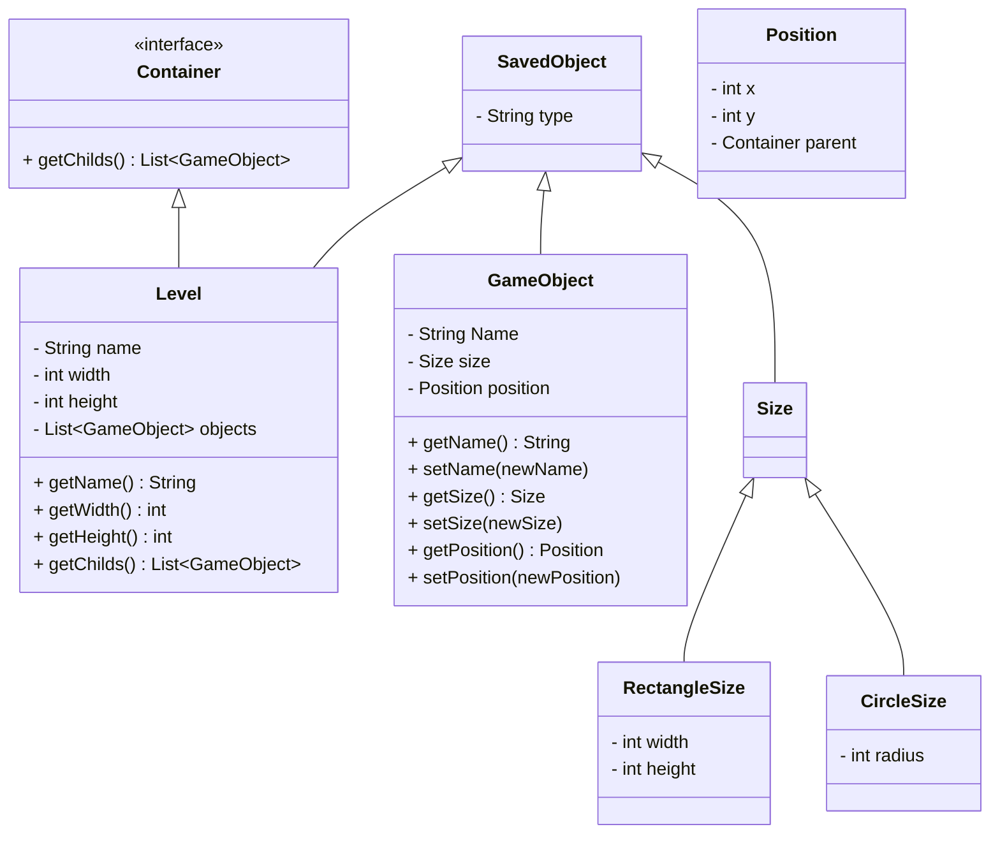

Das folgende Klassendiagram zeigt in erster Linie die Vererbung. Assoziationen / Kompositionen und Aggregationen sind nicht eingezeichnet um das Diagramm einfach zu halten.

```mermaid
classDiagram

class SavedObject {
  - String type
}

class Container {
  + getChilds() List~GameObject~
}
<<interface>> Container

Container <|--  Level
SavedObject <|-- Level
class Level {
  - String name
  - int width
  - int height
  - List~GameObject~ objects
  + getName() String
  + getWidth() int
  + getHeight() int
  + getChilds() List~GameObject~
}

SavedObject <|-- GameObject
class GameObject {
  - String Name
  - Size size
  - Position position
  + getName() String
  + setName(newName)
  + getSize() Size
  + setSize(newSize)
  + getPosition() Position
  + setPosition(newPosition)
}

SavedObject <|-- Size
class Size { }

Size <|-- RectangleSize
class RectangleSize {
  - int width
  - int height
}

Size <|-- CircleSize
class CircleSize {
  - int radius
}

class Position {
  - int x
  - int y
  - Container parent
}

```

