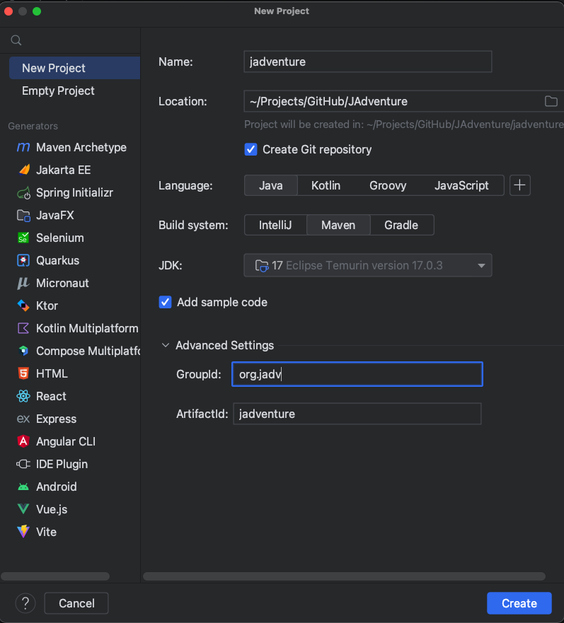

# Projekt

Wir erstellen in IntelliJ ein neues Maven Projekt. Dazu reicht es es aus, einfach unter New Project folgende Auswahl zu treffen:

</img>

- Name: jadventure
- Location: Ein Ort, an dem ein neues Verzeichnis jadventure angelegt werden soll für das Projekt.
- Create Git repository: Ja
- Language: Java
- Build System: Maven
- JDK: 17
- Add sample code: Ja
- Advanced Settings:
	- GroupId: org.jadv
	- ArtefactId: jadventure

Im Anschluss am Besten noch über das Maven Toolfenster den Maven Wrapper hinzufügen durch einen ```mvn wrapper:wrapper``` Aufruf.

Alternativ kannst Du das Projekt von 
<a href="https://github.com/kneitzel/JAdventure" target="_blank"> GitHub JAdventure Projekt unter https://github.com/kneitzel/JAdventure (extern) </a>   laden.

# Entities
Die ganzen Entity Klassen legen wir in den Namespace org.jadv.model. Um den Code klein zu halten, nutzen wir <a href="https://projectlombok.org/" target="_blank"> Lombok (extern)</a> .

## Level
Die Klasse Level enthält die folgenden Felder:
- String name
- int width
- int height
- List&lt;GameObject&gt; childs
	
## GameObject

Die Klasse GameObject bekommt
- String name
- Size size
- Position position

## Size

Die Klasse Size ist eine abstrakte Klasse mit den zwei abgeleiteten Klassen RectangleSize (mit width / height) und CircleSize (mit radius)

## Position
Die Klasse Position bekommt
- int x
- int y
für die Koordinate sowie einen Link auf den parent:
- Object parent

# Serialisierung mit Gson

