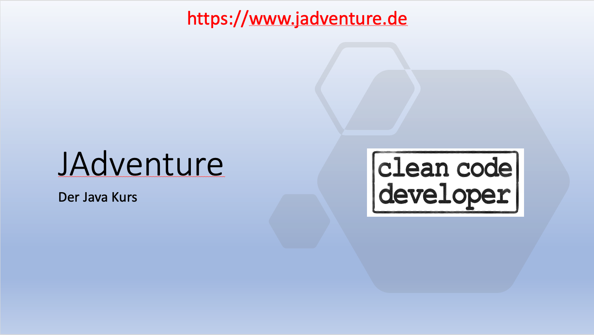



# Status
Derzeit ist der Kurs noch komplett im Aufbau. Die grobe Struktur der ersten Lektionen steht aber die erste Lektion muss erst einmal komplett erstellt werden.

Ich bitte um Verständnis, dass sich dies noch bis ca. **März 2023** hin ziehen wird.

Bis die Arbeiten abgeschlossen sind, werden die PeerTube und YouTube Links nur auf meinen jeweiligen Account verweisen.

# PeerTube & YouTube Video

 
|<a href="https://cliptube.org/a/konradn" target="_blank">PeerTube (extern)</a>|<a href="https://www.youtube.com/@KonradN" target="_blank">YouTube (extern)</a>|
|-|-|

# Was ist JAdventure

Bei JAdventure handelt es sich um ein Java Kurs, bei dem diverse Vorgehensweisen bei der Software Entwicklung gezeigt werden sollen.

| **Wichtig** | Dies ist keine Einführung in Java - Es wird erwartet, dass die ersten Grundlagen bezüglich Java Syntax bekannt sind. |
|-|-|

# Projektidee
Als Projekt wurde ein 2D RPG ausgesucht. Es wird eine einfache, "tile based" Anzeige geben.

Am Anfang wird die Entwicklung in Richtung eines Spieles gehen, das ähnlich wie nethack ein reines Einzelspieler Spiel sein wird. Die Kernidee ist, später aber auch den Netzwerkgedanken aufzugreifen und ein Spiel zu erstellen, welches von mehreren Spielern gleichzeitig gespielt werden kann.
(Bis dahin ist es aber ein weiter Weg und es ist unklar, ob dieses Ziel erreicht werden kann!)

# Umsetzung
Diesen Java Kurs werde ich sowohl hier auf der Webseite gestalten als auch mit Videos untermalen. Zu jeder Lektion / Kapitel soll es ein Video geben, welches entweder auf PeerTube (ohne Werbung) oder YouTube (mit Werbung) angesehen werden kann. Die entsprechenden Links finden sich direkt im Kopf der jeweiligen Seite.

# Welche Inhalte sollen vermittelt werden?
In diesem Kurs geht es vor allem um folgende Punkte
- Wie kann ein Projekt agil angegangen werden?
- Wie strukturiert man ein Projekt
- Umsetzung von Clean Code Vorgaben
